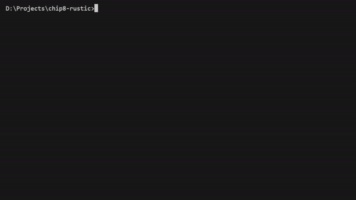

<h1 align="center">CHIP-8 Emulator</h1>

<p align="center">
  <a href="#installation">Installation</a> &#xa0; | &#xa0;
  <a href="#getting-started">Getting Started</a> &#xa0; | &#xa0;
  <a href="#chip-8-overview">CHIP-8 Overview</a> &#xa0; | &#xa0;
  <a href="#instruction-set">Instruction Set</a> &#xa0;
</p>

This project is a CHIP-8 emulator, which allows you to play classic CHIP-8 games on modern hardware. The emulator is built using Rust and SDL2 for rendering.



<h2 id="installation">Installation</h2>

To set up the CHIP-8 emulator, you need to install SDL2 for rust. For guidance on installing SDL2, especially on Windows, refer to the instructions provided in [this GitHub issue comment](https://github.com/PistonDevelopers/piston-examples/issues/391#issuecomment-336219251).

Once SDL2 is installed, you can build the emulator using Cargo:

```bash
cargo build --release
```

<h2 id="getting-started">Getting Started</h2>

To run the emulator, use the following command, specifying the path to a CHIP-8 ROM file. If no ROM file is specified, the emulator defaults to using rom/superpong.ch8.

```bash
cargo run --release <path-to-rom-file>
```

Replace `<path-to-rom-file>` with the path to your desired CHIP-8 ROM.

You can donwload ROMs from [John Earnest's Chip8 Community Archive](https://github.com/JohnEarnest/chip8Archive).

<h2 id="chip-8-overview">CHIP-8 Overview</h2>

CHIP-8 is an interpreted programming language developed by Joseph Weisbecker in the mid-1970s. It was designed for simplicity and ease of programming, primarily used on 8-bit microcomputers like the COSMAC VIP and Telmac 1800. CHIP-8 programs are typically games and demos, and the language has been implemented on various platforms, including modern computers, calculators, and mobile devices. For more information, visit the [CHIP-8 Wikipedia page](https://en.wikipedia.org/wiki/CHIP-8).

<h2 id="instruction-set">Instruction Set</h2>

CHIP-8 has a total of 35 opcodes, each two bytes long. Below is a brief overview of some key instructions:

| Opcode | Type    | C Pseudo           | Explanation                                                                  |
| ------ | ------- | ------------------ | ---------------------------------------------------------------------------- |
| 00E0   | Display | `disp_clear()`     | Clears the screen.                                                           |
| 00EE   | Flow    | `return;`          | Returns from a subroutine.                                                   |
| 1NNN   | Flow    | `goto NNN;`        | Jumps to address NNN.                                                        |
| 6XNN   | Const   | `Vx = NN`          | Sets VX to NN.                                                               |
| 7XNN   | Const   | `Vx += NN`         | Adds NN to VX (carry flag is not changed).                                   |
| ANNN   | MEM     | `I = NNN`          | Sets I to the address NNN.                                                   |
| DXYN   | Display | `draw(Vx, Vy, N)`  | Draws a sprite at coordinate (VX, VY) with a width of 8 pixels and height N. |
| FX07   | Timer   | `Vx = get_delay()` | Sets VX to the value of the delay timer.                                     |
| FX1E   | MEM     | `I += Vx`          | Adds VX to I. VF is not affected.                                            |

For a complete list of instructions, visit the [CHIP-8 Instruction Set](https://chip8.gulrak.net/).
